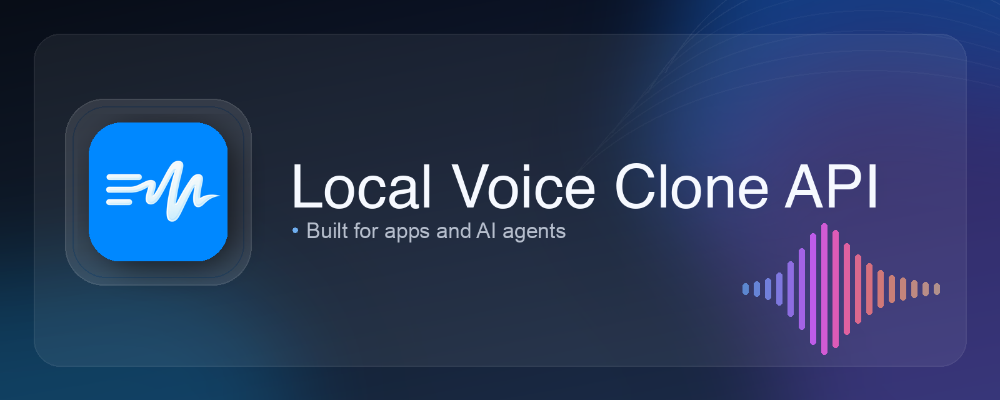

<div align="center">



## Local voice cloning API

<p>
  
  
  
</p>
<p>
  
  
</p>

**One-line install. Local HTTP API. iOS pairing. Optional BlueBubbles audio-message routing.**

</div>

> Voice cloning should be callable like infrastructure: by your phone, your scripts, and your agent.

`local-voice-clone-api` is a local-first voice cloning server built around `coqui/XTTS-v2`.

It is designed for two workflows:
- humans who want to run a private local TTS server once and use it from an iPhone app
- AI agents that need a stable local voice-cloning endpoint they can install and call directly

This repo is the backend only. It does **not** include the iOS app code.

## Features

- **XTTS-v2 voice cloning API** with `POST /v1/tts`
- **Background runtime on macOS** via `launchd`
- **Agent-friendly install** with a non-interactive bootstrap script
- **iOS pairing flow** with pairing URL + QR generation
- **Optional BlueBubbles routing** for iMessage-style audio-message delivery
- **Local-first deployment** with no hosted control plane required

## Quick Start

### One-line install

```bash
bash -lc 'set -e; TMP_DIR="$(mktemp -d)"; git clone --depth=1 https://github.com/zijie-cai/local-voice-clone-api.git "$TMP_DIR/local-voice-clone-api"; cd "$TMP_DIR/local-voice-clone-api"; ./install.sh'
```

The installer will:
- create `.venv`
- install Python dependencies
- create `.env` from `.env.example`
- generate `XTTS_AUTH_TOKEN` if it is missing or still a placeholder
- install and start a `launchd` service named `com.xtts.server`

### Health check

```bash
curl -s http://127.0.0.1:8020/v1/health
```

### Read your token

```bash
grep '^XTTS_AUTH_TOKEN=' .env
```

### Generate a clip

```bash
export XTTS_TOKEN="$(grep '^XTTS_AUTH_TOKEN=' .env | cut -d= -f2-)"

curl -X POST "http://127.0.0.1:8020/v1/tts" \
  -H "Authorization: Bearer $XTTS_TOKEN" \
  -F 'payload={"text":"Hello from local-voice-clone-api","language":"en","options":{"speed":1.0}}' \
  -F "speaker_wav=@/path/to/voice.wav;type=audio/wav" \
  --output /tmp/local-voice-clone-api.wav

afplay /tmp/local-voice-clone-api.wav
```

## Requirements

- macOS for the bundled one-line installer / `launchd` flow
- Python `3.10` to `3.12`
- `git`
- enough disk space for the XTTS-v2 model download

Optional:
- `ffmpeg` for broader audio conversion support
- Tailscale if you want to reach your server remotely
- BlueBubbles if you want iMessage-style audio-message sending

## For AI Agents

This repo is intentionally usable from automation:

- non-interactive installer
- local bearer-token auth
- simple `multipart/form-data` API
- background runtime that survives terminal closure

Agent install example:

```bash
WITH_LAUNCHD=1 USE_CAFFEINATE=0 PYTHON_BIN=python3.12 ./install.sh
```

Installer flags:
- `WITH_LAUNCHD=0` -> setup environment only, skip background service install
- `USE_CAFFEINATE=1` -> run the service through `caffeinate`
- `PYTHON_BIN=...` -> force a specific Python binary

Minimum contract for any agent:
- know the host
- know the port
- know the token
- send `POST /v1/tts` with `speaker_wav` + `payload`

## Pair the iOS App

The iOS app pairs against a URL generated by the backend.

If you run the server in the foreground, it prints:
- a pairing URL (`xtts://pair?...`)
- an ASCII QR directly in the terminal

```bash
source .venv/bin/activate
uvicorn app.main:app --host 0.0.0.0 --port 8020 --workers 1
```

If you usually run the server through `launchd`, regenerate a QR with:

```bash
source .venv/bin/activate
python scripts/generate_pairing_qr.py
```

Notes:
- `XTTS_PAIR_HOST` overrides the host embedded in the pairing URL
- if blank, the backend will try to choose a usable local or Tailscale address

## API

### `GET /v1/health`

Returns server and model readiness.

Typical fields include:
- `status`
- `model_loaded`
- `model`
- `device`
- `bonjour_advertised`
- `version`

### `POST /v1/tts`

Generate a WAV file by cloning a reference voice.

Auth:

```http
Authorization: Bearer <token>
```

Content type:

```text
multipart/form-data
```

Multipart parts:
- `speaker_wav=@file`
- `payload={"text":"...","language":"en","options":{"speed":1.0}}`

Response:
- success -> `audio/wav`
- failure -> JSON error payload

Example:

```bash
export XTTS_TOKEN="$(grep '^XTTS_AUTH_TOKEN=' .env | cut -d= -f2-)"

curl -X POST "http://127.0.0.1:8020/v1/tts" \
  -H "Authorization: Bearer $XTTS_TOKEN" \
  -F 'payload={"text":"Bonjour depuis XTTS local","language":"fr","options":{"speed":1.0}}' \
  -F "speaker_wav=@/path/to/voice.wav;type=audio/wav" \
  --output /tmp/output.wav
```

## Core Config

Main `.env` values:

```bash
XTTS_HOST=0.0.0.0
XTTS_PORT=8020
XTTS_AUTH_TOKEN=change-me-now
XTTS_MODEL_NAME=tts_models/multilingual/multi-dataset/xtts_v2
XTTS_MAX_TEXT_CHARS=1200
XTTS_MAX_AUDIO_SECONDS=15
XTTS_MAX_UPLOAD_MB=10
XTTS_TEMP_DIR=/tmp/xtts-server
XTTS_LOG_LEVEL=INFO
XTTS_BONJOUR_ENABLED=true
XTTS_SHOW_PAIRING_QR=true
XTTS_PAIR_HOST=
```

Important:
- the server is the source of truth for final validation
- clients may still keep stricter UI-side limits

## Optional: BlueBubbles Audio Message Routing

This is disabled by default.

Enable in `.env`:

```bash
XTTS_IMSG_AUTOSEND_ENABLED=false
XTTS_IMSG_HOST=
XTTS_IMSG_PASSWORD=
XTTS_IMSG_CHAT_GUID=
XTTS_IMSG_FFMPEG_BIN=ffmpeg
XTTS_IMSG_CURL_BIN=curl
XTTS_IMSG_TIMEOUT_SECONDS=30
```

When enabled, generated output can be converted and sent through a BlueBubbles-compatible audio-message pipeline.

This is optional infrastructure. Core voice generation works without it.

## Service Control

Check status:

```bash
launchctl print gui/$(id -u)/com.xtts.server
```

Restart:

```bash
launchctl kickstart -k gui/$(id -u)/com.xtts.server
```

Stop:

```bash
launchctl bootout gui/$(id -u) ~/Library/LaunchAgents/com.xtts.server.plist
```

Logs:

```bash
tail -f /tmp/xtts.out.log /tmp/xtts.err.log
```

## Repo Layout

```text
.
├── app/                             # FastAPI app, auth, model runtime, audio helpers
├── scripts/                         # launchd + run helpers + QR helper
├── launchd/                         # plist template
├── install.sh                       # bootstrap installer
├── .env.example                     # environment template
└── requirements.txt
```

## Troubleshooting

### Python version mismatch

Use Python `3.10` to `3.12`:

```bash
PYTHON_BIN=python3.12 ./install.sh
```

### Dependency issues

Recreate the virtual environment:

```bash
rm -rf .venv
./install.sh
```

### Server is not responding

Check:

```bash
launchctl print gui/$(id -u)/com.xtts.server
tail -f /tmp/xtts.out.log /tmp/xtts.err.log
```

### The Mac sleeps and the server disappears

Use:

```bash
USE_CAFFEINATE=1 ./install.sh
```

Or adjust macOS power settings so the machine stays awake when needed.

### iOS app cannot pair

Verify:
- the server is reachable from the phone
- the token is correct
- the pairing host is correct
- `XTTS_PAIR_HOST` is set if auto-detection chooses the wrong address

## Known V1 Scope

This repo is a practical V1.

Strong today:
- local XTTS generation
- launchd background runtime
- token auth
- iOS pairing
- agent-friendly install + API usage

Still intentionally simple:
- macOS-first installer
- no dynamic client sync for every server-side limit
- no hosted control plane

## Attribution

Voice cloning and speech generation are powered by Coqui XTTS-v2.

Model reference:
- [coqui/XTTS-v2](https://huggingface.co/coqui/XTTS-v2)
